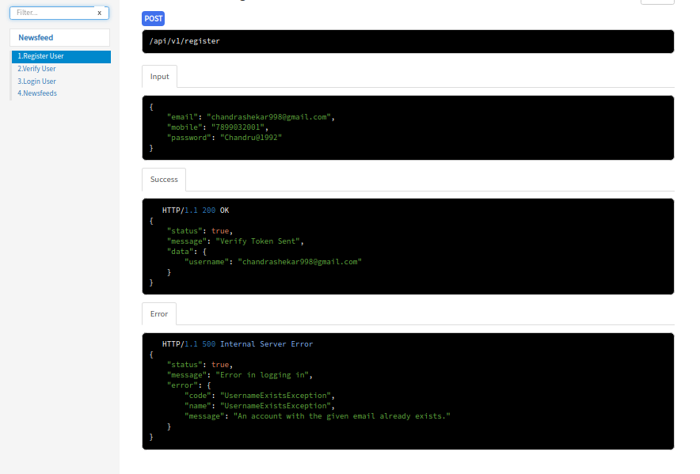
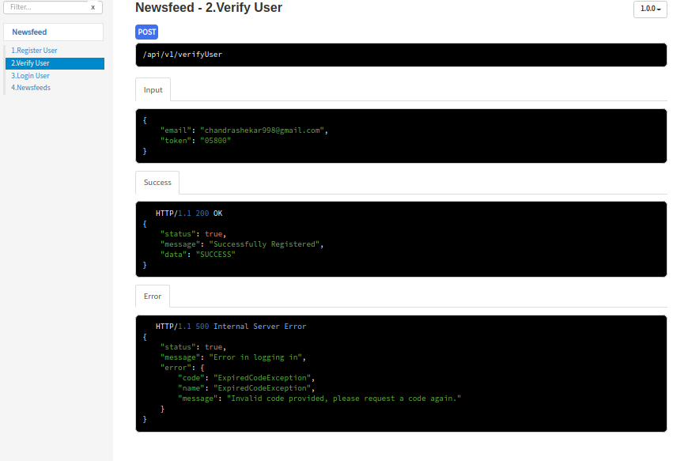
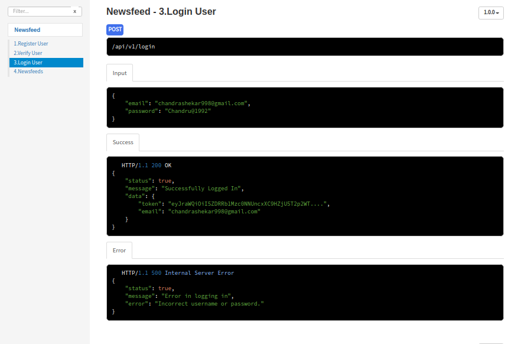
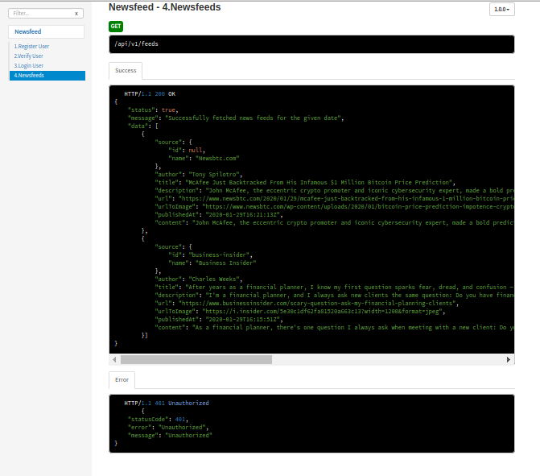
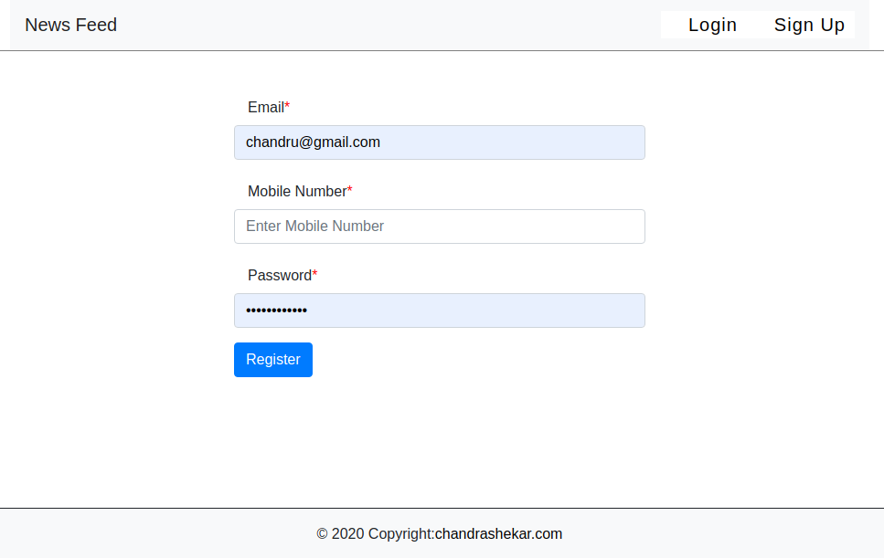
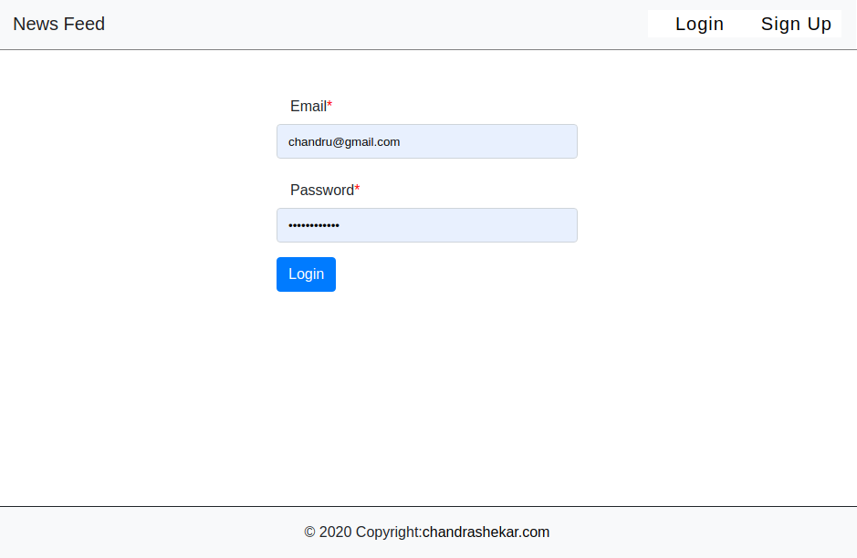
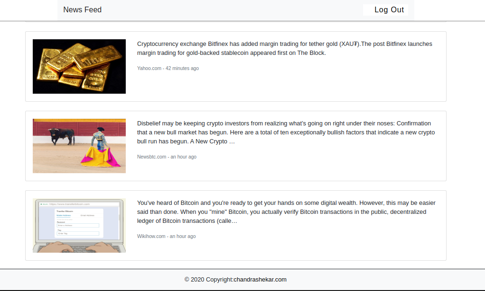

# News Feed  
<h1 align="center">News Feed App using MERN Stack</h1>
 
## API Documentation:-
 To Generate API Documentation
 ```
    npm install apidoc -g
    apidoc -i backend/controllers -o apidoc
```
<table>
<tr>
<td></td>
<td>
 
</td>
 </tr>
 <tr>
 <td></td>
 <td></td>
 </tr>
 </table>

 
## START  Frontend and Backend
```
docker-compose up --build 
```
- Enter http://0.0.0.0:3000 in Browser To See URL Shortner App
## To Register


## To Login


## Newsfeeds
